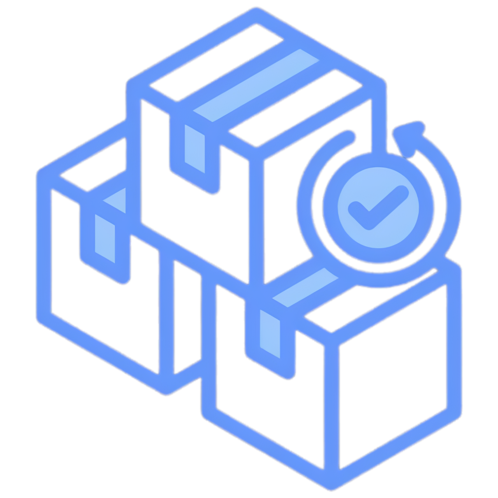

<p align="center">
  
</p>

<h1 align="center">Nexo Estoque</h1>

<p align="center">
  Sistema web de controle de estoque para pequenos/médios comércios — cadastro de empresa/funcionario, cadastro de produtos,
  movimentações, pedidos de compra, validade de lotes, financeiro, relatórios e equipe com permissões.
</p>

<p align="center">
  
  
  
  
  
</p>

---

## 📑 Sumário

- [Sobre](#-sobre)
- [Funcionalidades](#-funcionalidades)
- [Tecnologias](#-tecnologias)
- [Pré-requisitos](#-pré-requisitos)
- [Instalação (Docker — recomendado)](#-instalação-docker--recomendado)
- [Configuração de e-mail (SMTP)](#-configuração-de-e-mail-smtp)
- [Primeiro acesso](#-primeiro-acesso)
- [Portas e serviços](#-portas-e-serviços)
- [Comandos úteis](#-comandos-úteis)
- [Solução de problemas](#-solução-de-problemas)
- [Estrutura do projeto](#-estrutura-do-projeto)
- [Autor](#-autor)
- [Licença](#-licença)

---

## 📦 Sobre

O **Nexo Estoque** é um sistema web feito para pequenos/médios comerciantes ou estabelecimentos terem controle total do
estoque dos seus produtos: o que entra, o que sai, o que está acabando e o que está vencendo.
Tem painel com indicadores, controle de equipe com permissões por aba, fluxo de aprovação de
pedidos e movimentações, relatórios em PDF/CSV e tema claro/escuro.

> Projeto desenvolvido com Laravel 12 + MySQL, rodando em Docker.

---

## ✨ Funcionalidades

- **Dashboard** com total de produtos, valor em estoque, itens em estoque baixo e sem estoque,
  além de alertas de validade dos lotes.
- **Produtos**: cadastro completo (nome, SKU, categoria, quantidade, mínimo, preço, fornecedor,
  localização), busca e filtros, exportação em **CSV** e **PDF** (estoque baixo).
- **Movimentações**: entradas, saídas, ajustes, transferências e devoluções, com histórico e
  geração de **documento** por movimentação.
- **Pedidos de Compra**: criação, recebimento e relatório em PDF.
- **Categorias e Fornecedores**: gestão completa.
- **Validade / Lotes**: controle de lotes por validade, com alertas de vencimento.
- **Financeiro**: contas a pagar e a receber, com fluxo de caixa.
- **Equipe e permissões**: o administrador cria funcionários e libera o acesso por aba.
- **Cadastro com aprovação**: novos cadastros entram como pendentes; o admin aprova ou recusa
  (com aviso por e-mail ao usuário).
- **Aprovação de pedidos e movimentações** feitos por funcionários.
- **Notificações** de atividade da equipe (no sistema e por e-mail).
- **Redefinição de senha** por e-mail.
- **Tema claro/escuro** com botão, salvo na conta (vale em qualquer dispositivo).

---

## 🛠 Tecnologias

| Camada        | Tecnologia                                  |
|---------------|---------------------------------------------|
| Back-end      | PHP 8.2+, Laravel 12                         |
| Banco         | MySQL 8.0                                    |
| Front-end     | Blade, Bootstrap 5, JavaScript, Chart.js    |
| Ambiente      | Docker + Docker Compose                      |
| Admin do banco| phpMyAdmin                                   |
| PDF           | Geração de relatórios e documentos em PDF    |

---

## ✅ Pré-requisitos

Você só precisa de duas coisas instaladas:

- **[Docker](https://www.docker.com/products/docker-desktop/)** (Docker Desktop no Windows/Mac)
- **[Git](https://git-scm.com/downloads)**

> Não precisa instalar PHP, Composer ou MySQL na sua máquina — tudo roda dentro do Docker.

---

## 🚀 Instalação (Docker — recomendado)

### 1. Clonar o repositório

```bash
git clone https://github.com/LuizBail2/NOME-DO-REPOSITORIO.git
cd NOME-DO-REPOSITORIO
```

### 2. Criar o arquivo de ambiente

Copie o arquivo de exemplo:

```bash
# Linux / Mac
cp .env.example .env

# Windows (PowerShell)
copy .env.example .env
```

Abra o `.env` e confirme que as configurações do banco batem com o Docker:

```dotenv
DB_CONNECTION=mysql
DB_HOST=db
DB_PORT=3306
DB_DATABASE=estoque
DB_USERNAME=laravel
DB_PASSWORD=laravel123
```

> **Importante:** dentro do Docker o host do banco é `db` (o nome do serviço), e a porta é `3306`.
> A porta `3307` é só para você acessar o MySQL de fora (pela sua máquina), se quiser.

### 3. Subir os containers

```bash
docker compose up -d --build
```

Isso cria 3 serviços: a aplicação, o MySQL e o phpMyAdmin. A primeira vez demora um pouco
(ele baixa as imagens e instala as dependências).

### 4. Instalar as dependências do PHP

```bash
docker compose exec app composer install
```

### 5. Gerar a chave da aplicação

```bash
docker compose exec app php artisan key:generate
```

### 6. Rodar as migrações (criar as tabelas)

```bash
docker compose exec app php artisan migrate
```

> Se quiser começar com dados de exemplo (caso o projeto tenha seeders), use:
> `docker compose exec app php artisan migrate --seed`

### 7. Acessar

Abra no navegador:

```
http://localhost:8000
```

Pronto! 🎉 Na primeira vez, o primeiro cadastro feito vira o administrador.

---

## 📧 Configuração de e-mail (SMTP)

Vários recursos enviam e-mail (redefinição de senha, aprovação de cadastro, notificações da
equipe). Por padrão o `.env` vem com `MAIL_MAILER=log`, ou seja, o e-mail é **gravado em arquivo**
(`storage/logs/laravel.log`), não enviado de verdade.

Para enviar e-mails reais, configure um provedor SMTP no `.env`. Exemplo com **Gmail**:

```dotenv
MAIL_MAILER=smtp
MAIL_HOST=smtp.gmail.com
MAIL_PORT=587
MAIL_USERNAME=seuemail@gmail.com
MAIL_PASSWORD=sua_senha_de_app
MAIL_ENCRYPTION=tls
MAIL_FROM_ADDRESS="seuemail@gmail.com"
MAIL_FROM_NAME="Nexo Estoque"
```

> **Senha de app:** o Gmail não aceita a senha normal. Ative a verificação em 2 etapas na sua
> conta Google e gere uma **Senha de app** (16 caracteres) em
> [myaccount.google.com/apppasswords](https://myaccount.google.com/apppasswords). Use esses 16
> caracteres em `MAIL_PASSWORD`.

Depois de editar o `.env`, limpe o cache de configuração:

```bash
docker compose exec app php artisan config:clear
```

O remetente (do `.env`) é fixo; o destinatário é o e-mail de cada usuário — não precisa cadastrar
e-mail de usuário no `.env`.

---

## 🔑 Primeiro acesso

1. Acesse `http://localhost:8000` e vá em **Cadastre-se**.
2. O **primeiro cadastro** do sistema vira o **administrador** automaticamente.
3. A partir daí, novos cadastros entram como **pendentes** — o administrador aprova ou recusa em
   **Perfil → Novos cadastros**, e libera as abas de cada funcionário em **Perfil → Equipe**.

---

## 🌐 Portas e serviços

| Serviço      | URL / Acesso              | Observação                          |
|--------------|---------------------------|-------------------------------------|
| Aplicação    | http://localhost:8000     | O sistema em si                     |
| phpMyAdmin   | http://localhost:8080     | Administração visual do banco       |
| MySQL        | localhost:3307            | Acesso externo ao banco (opcional)  |

**Credenciais do banco (padrão do projeto):**

| Campo    | Valor        |
|----------|--------------|
| Database | `estoque`    |
| Usuário  | `laravel`    |
| Senha    | `laravel123` |
| Root     | `root123`    |

> ⚠️ Essas credenciais são para ambiente de **desenvolvimento**. Em produção, troque todas e
> nunca versione o `.env` com dados reais.

---

## 🧰 Comandos úteis

```bash
# Ver os containers rodando
docker compose ps

# Ver logs da aplicação
docker compose logs -f app

# Entrar no terminal do container da aplicação
docker compose exec app bash

# Limpar caches do Laravel (rotas, config, views)
docker compose exec app php artisan optimize:clear

# Rodar o Tinker (console interativo)
docker compose exec app php artisan tinker

# Parar tudo
docker compose down

# Parar tudo e APAGAR o banco (volume)
docker compose down -v
```

---

## 🩺 Solução de problemas

**`failed to read .env ... unexpected character "$" in variable name`**
Alguma linha do `.env` usa uma variável dentro de outra, tipo `VITE_APP_NAME="${APP_NAME}"`.
Troque por um valor fixo: `VITE_APP_NAME="Nexo Estoque"`.

**Mudei o `.env` e nada mudou**
O Laravel guarda a config em cache. Rode `docker compose exec app php artisan config:clear`
(e `optimize:clear`).

**E-mail dá erro `535 ... Username and Password not accepted` (Gmail)**
Você está usando a senha normal do Gmail. Use a **Senha de app** (16 caracteres) e confirme que a
verificação em 2 etapas está ativa.

**Erro de conexão com o banco (`SQLSTATE[HY000] [2002]`)**
Confirme no `.env`: `DB_HOST=db` e `DB_PORT=3306` (dentro do Docker é assim). Verifique também se
o container `estoque_db` está de pé com `docker compose ps`.

**Alterei o CSS e o navegador mostra o estilo antigo**
É cache do navegador. Force o recarregamento com **Ctrl + Shift + R**.

**Porta 8000 (ou 8080/3307) já está em uso**
Edite o lado esquerdo da porta no `docker-compose.yml` (ex.: troque `"8000:80"` por `"8001:80"`)
e suba de novo.

---

## 📂 Estrutura do projeto

```
.
├── app/
│   ├── Http/Controllers/     # Controllers (Produtos, Movimentações, Pedidos, Auth, etc.)
│   ├── Models/               # Models (Product, Movement, PurchaseOrder, User, etc.)
│   └── ...
├── database/
│   └── migrations/           # Migrações (estrutura das tabelas)
├── public/
│   └── css/                  # Estilos (dashboard-pro.css, login-pro.css, ...)
├── resources/
│   └── views/                # Telas em Blade (dashboard, products, movements, ...)
├── routes/
│   └── web.php               # Rotas da aplicação
├── docker-compose.yml        # Serviços: app, db (MySQL), phpmyadmin
├── Dockerfile                # Imagem da aplicação (PHP + Apache)
└── .env.example              # Modelo de variáveis de ambiente
```

---

## 👤 Autor

**Luiz Gustavo Bail**

- 📧 luizgustavobail4@gmail.com
- 🐙 [github.com/LuizBail2](https://github.com/LuizBail2)

---

## 📄 Licença

Este projeto está sob a licença **MIT**. Veja o arquivo `LICENSE` para mais detalhes.
SITORIO.git
cd NOME-DO-REPOSITORIO
